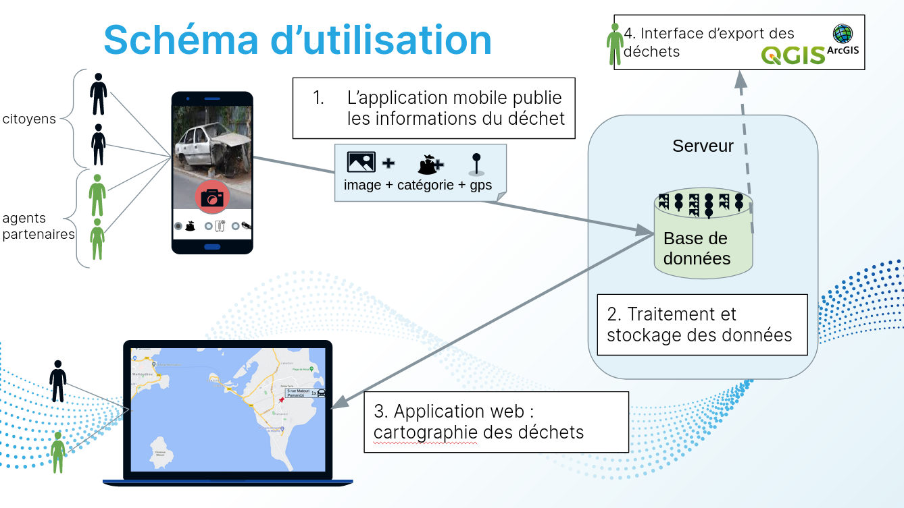
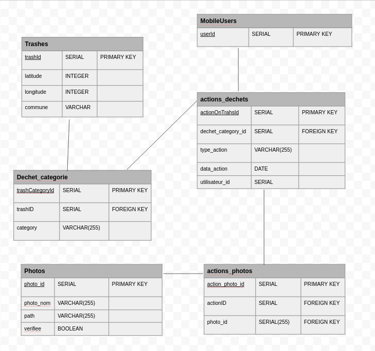

# Kavu-Backend

## Fonctionnement
L'application Kavu permet de géolocaliser des déchets : 



## Details de l'API
L'API est en python, elle fait l'intermédiaire entre les requêtes et la base de données.

## Installation 

### Installation de la base de données (~5 min)
La base de données de test que nous utilisons est sous docker.
Pour installer docker et docker-compose :
* [Docker](https://docs.docker.com/engine/install/)
* [Docker compose](https://docs.docker.com/compose/install/)
* 
Pour vérifier l'installation tester les commandes ci-dessous : 
```bash
docker --version
docker-compose --version
docker run hello-world # Lance un container d'exemple
```
### Installation des modules python (~2 mins)
L'application utilise le framework flask, ainsi que plusieurs modules. Pour effectuer une installation complète :
```bash
pip install -r python-backend/requirements.txt -v
```

## Lancement
### Base de données
Une fois docker et docker-compose installés, vous pouvez lancer la base de données :
```bash
cd python-backend
docker-compose up kavu-backend &
```
Une base est lancée et disponible au port 5432 (les informations de la base se trouvent dans le fichier docker-compose.yml).

### API Python
une fois la base prête, vous pouvez lancer l'API python : 
```bash
python3 dechetAPI.py
```
Application active sur le port 5000 (http://localhost:5000/apidocs)

**NOTE** Le POST /dechet/ swagger ne fonctionne pas, utiliser curl :
```bash
# Récupération de tous les déchets
curl http://localhost:5000/dechet/
# Post d'un dechets
curl -d "latitude=-12.9025&longitude=45.07611&categories=d3e,vhu" -X POST "http://localhost:5000/dechet/"
# Post dechet image
curl -F "photo=@mon_image.jpg" -X POST http://localhost:5000/photo/
```

## Structure projet

## Base de données


Dechet catégorie permet à un déchet d'avoir plusieurs catégories (bois et métal par exemple)
Une action_dechet enregistre toutes les actions effectuées sur un déchet_catégorie (création, néttoyage, suppression...)
Actions_photos est une table de jointures entre les actions et les photos.

Par exemple pour un déchet publié avec deux catégories (D3E/VHU).

```bash
# Post d'un dechets
curl -d "latitude=-12.9025&longitude=45.07611&categories=d3e,vhu" -X POST "http://localhost:5000/dechet/"
```

* Un dechet sera ajouter avec la lattitude, longitude et la commune détectée.
* Deux dechet_categories seront ajoutés, avec recpectivement les catégories D3E et VHU
* Deux actions seront ajoutées, marquant la création des deux dechet_categories.
## Python
Le point d'entrée est dechetAPI. Il s'agit d'une API Python Flask au format REST. La documentation des méthodes est automatiquement chargée par le module Swagger (endpoint /apidocs )

## persistence
Le dossier dossier contient toute les opérations sur la base de données :
* config_persistence permet d'initialiser la base si cette dernière est vierge
* crud_persistence gère toutes les sauvegardes de déchets (hors image)
* images_persistences sauvegarde les images de déchets

## Docker
* Le fichier Dockerfile permet de définir comment construire une image Docker/Kavu-Back
* Le fichier docker-compose.yml regroupe toutes les composants du back (base de données + API python)


## Ressources
[postgresql](https://www.postgresqltutorial.com/postgresql-python/connect/)

# Maintenance serveur (pour les administrateurs)
## Changement Version
* Pusher le répo
* Merge request sur master/main
* Tagger le repo git tag V.x.x
* Aller sur le serveur Pikachu -> Répertoire python-backend
* Attention ne pas faire d'actions docker irréversibles (up/build/down risqués... passer par le script update-backend.sh)
```sh 

# Faire git status   -> Trois fichiers doivents être en cours de moidifications (vert ou rouge) : docker-compose.yml,  assets/database/database.ini et update-backend.sh
git status

# Faire un git stash pour oublier temporairement les modifications
git stash

# Vérifier qu'on est sur la branche master
git checkout master

# Faire un git pull
git pull

# Faire git stash pop pour resortir les configs
git stash pop

# Ne pas lancer de commandes docker ! Utiliser le script conçus pour ça :
./update-backend.sh

```

Vérifier l'endpoint : http://51.68.90.188:5500/apidocs/